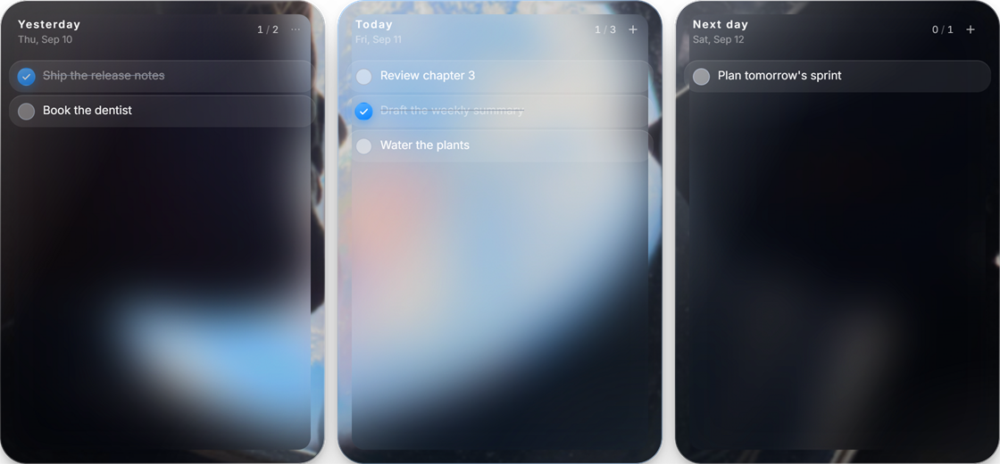

# Liquid Todo

A desktop todo widget for Windows that lives on the wallpaper layer: three day columns
inside frosted glass panels that refract whatever sits behind them.

Written with Electron, React and TypeScript. No account, no cloud, no network calls.

## Features

- **Three day columns** - Yesterday (read only), Today and Next day.
- **Drag and drop** tasks inside a column or across days. Only Today has check boxes: tick a task
  off and it drops to the bottom of the column, while new tasks join the open work above the
  finished ones. Today keeps three bands - work carried over from an earlier day at the top,
  the ordinary open tasks you can order freely in the middle, finished work at the bottom - and
  Yesterday with Next day stay plain lists.
- **Midnight rollover** - the next day's plan becomes the new today, unfinished tasks from the
  ending day are carried over *above* the plan with a "carried over" badge, and the day that
  just ended keeps its unfinished tasks on top with a "moved to today" badge. Everything older
  than the retention window is purged. A badge stays put while a task is dragged around and is
  cleared by ticking the task off.
- **History window** - the last six days, each behind a dividing rule with a centred, bolded
  date and its done/total count. Like the Yesterday column, a finished day shows what was left
  undone above what got done, including days recorded by an earlier version.
- **Liquid glass** - every panel samples the wallpaper under its own position, so the blur and
  the refraction line up with the real desktop. All Windows wallpaper fit modes are honoured
  (fill, fit, stretch, center, span, tile).
- **Desktop integration** - the widget attaches itself to the desktop layer (WorkerW, with a
  fallback when Windows refuses), where it stays behind every other application and comes back
  after Show Desktop. The ownership is verified before the widget is ever lifted and re-checked
  while it runs, so it cannot drift in front of your work — not even when a fullscreen game or
  video switches modes. Turn the pin off and it becomes an ordinary window that floats above the
  desktop and disappears with Show Desktop.
- **Tray menu** - show/hide, open history, refresh backdrop, pin to desktop layer, keep on top,
  glass look (follow Windows / light / dark), start with Windows, quit.
- **Frameless chrome** - drag a window by its header, resize it from any edge or corner.
- **Local data** - tasks live in a JSON file on your machine, writes are atomic and a corrupt
  file is quarantined rather than silently dropped.

## Install

Windows 10 or 11, x64.

1. Download `Liquid.Todo.Setup.<version>.exe` from the
   [releases page](https://github.com/Luis-huan/liquid-todo/releases).
2. Run it. The install is per user, you can pick the folder, and desktop plus start menu
   shortcuts are created.

The installer is not code signed, so Windows SmartScreen may warn the first time. Choose
*More info* then *Run anyway*.

## Using it

- Left click the tray icon to show or hide the widget, right click for the menu.
- Changed your wallpaper? Tray menu then *Refresh backdrop*.
- Tasks are windowed to a rolling week; anything older falls out of history.
- Uninstalling leaves your data in place. It lives in `%APPDATA%\liquid-todo\data.json`.

## Development

Node.js 20 LTS or newer, and pnpm (npm works too).

```bash
pnpm install
pnpm dev          # run the app with hot reload
pnpm test         # unit tests: rollover rules, persistence, date helpers
pnpm typecheck    # type check the main and renderer projects
pnpm build        # compile to out/
pnpm dist         # build and produce the NSIS installer in release/
```

Packaging note: electron-builder downloads its NSIS and code signing toolchain on first run.
If it fails with a move or rename error, point `ELECTRON_BUILDER_CACHE` at a folder on the same
drive as the project and retry.

## Project layout

| Path | What lives there |
| --- | --- |
| `src/main` | Electron main process: windows, tray, desktop layer, wallpaper sampling, persistence |
| `src/preload` | Context isolated bridge exposed to the renderer |
| `src/renderer` | React UI: the board, the history window, glass rendering |
| `src/shared` | Types, date maths, rollover rules, store normalisation |
| `tests` | Vitest suites for the shared logic |

## Screenshot



## Changelog

Release by release changes are listed in [CHANGELOG.md](CHANGELOG.md).

## License

MIT
